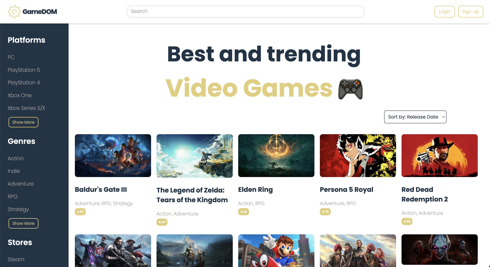
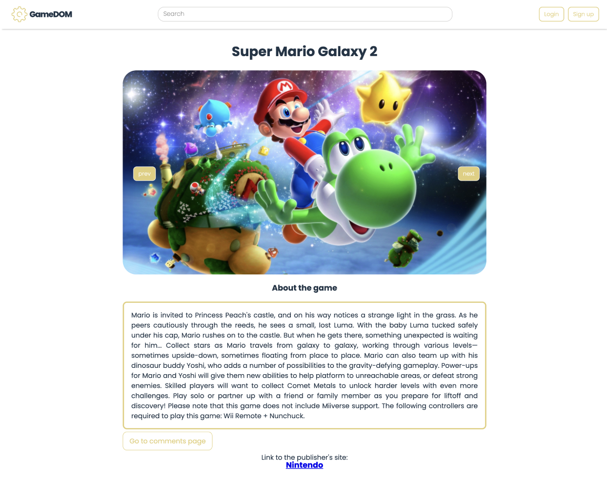

# GameDOM

Welcome to [GameDOM](https://gamedom.netlify.app), a video game website built with the React library, which utilizes an API to fetch game data. It also features a local backend to manage user login information and comments. This README provides essential information about the project, its features, and how to deploy it.



## Table of Contents

1. [Features](#features)
2. [API Reference](#api-reference)
3. [Deployment](#deployment)

## Features

GameDOM is equipped with a variety of features that enhance the gaming experience for its users:

1. Search Bar

A search bar is prominently displayed on all pages, allowing users to easily find their favorite games.

2. Navigation Bar

A user-friendly navigation bar is located on the left side of the home pages, enabling seamless access to different sections of the website.

3. Multiple Filters and Sorting

GameDOM provides multiple filters to refine the game search results based on various criteria such as genre, platform, and stores.

4. Log In/Sign Up

Users have the option to log in or sign up for a personalized experience. This feature enables the management of comments and interactions.

5. User Comments

GameDOM allows users to read all comments from fellow gamers, providing valuable insights and opinions about various games.

6. Comment Management

Logged-in users have the ability to leave and remove comments, enhancing the engagement and interaction within the gaming community.



## API Reference

GameDOM uses the [RAWG Video Games Database API](https://api.rawg.io) to fetch game data. Below are key endpoints for reference:

#### Get all items

Endpoint:

```http
   GET /api/games?key=api_key
```

| Parameter | Type     | Description                |
| :-------- | :------- | :------------------------- |
| `api_key` | `string` | **Required**. Your API key |

#### Get item

Endpoint:

```http
  GET /api/games/${id}/?key=api_key

```

| Parameter | Type     | Description                       |
| :-------- | :------- | :-------------------------------- |
| `id`      | `string` | **Required**. Id of game to fetch |
| `api_key` | `string` | **Required**. Your API key        |

## Deployment

You can access the project at https://gamedom.netlify.app.

Feel free to explore, enjoy the gaming experience, and engage with the gaming community on GameDOM!

For any questions, issues, or inquiries, please contact us on GitHub.

Thank you and happy gaming!
